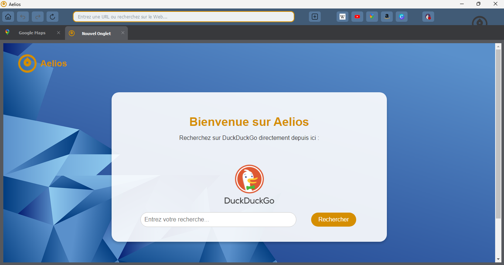

<div align="center">
    
</div>

<h3>Here is the code for Aelios Browser, a simple, privacy-friendly Chromium browser coded with Python and the PyQt5 library.</h3>
<br>

<div align="center">
    
</div>
<br>

<hr style="height:2px; background-color:gray; border:none;">
<br>

<h4>First stage :</h4>
To access to the Tor network, you'll need to download the executable. With this little application, the programm will have the possibility to switch between the Tor network and the regular internet.
<br><br>
Here is the link if you want to download the Tor executable : https://www.torproject.org/download/tor/
<br><br>
Then, you'll need to write the path to your own Tor executable in <code>config.json</code> :
<br><br>

```json
{
    "tor_path": "path\\to\\your\\tor\\executable",
    "comment": "Change the tor_path with your own path which goes to the Tor executable, see the README.md for more informations"
}
```
<br>

<hr style="height:2px; background-color:gray; border:none;">
<br>

<h4>Second stage :</h4>
To install the dependencies, you'll need to run one command depending the system you have. Don't hesitate to create a venv if you need.
First, with your terminal, navigate to the directory which contains the file <code>requirements.txt</code> :
<br><br>
Then, run this command :
<br><br>
Windows / Linux :

```shell
pip install -r requirements.txt
```
MacOS :
```shell
pip3 install -r requirements.txt
```
<br>

<hr style="height:2px; background-color:gray; border:none;">
<br>

<h4>Third stage :</h4>
Run the script <code>Aelios.py</code> and enjoy...
<br><br>

<hr style="height:2px; background-color:gray; border:none;">
<br>

<h4>Personalize your browser :</h4>
<h5>Change the home background and the icons :</h5>
In the <code>assets</code> directory, you can directly change the files with your own background or icons. Don't forget that their name must be the same as the old files.
<h5>Change the colors :</h5>
In <code>Aelios.py</code>, every element has its own stylesheet, here is a simple exemple :
<br><br>

```python
self.setStyleSheet("""
    QMainWindow {
    background-color: #38393c;
    }
""")
```
You can change the values of every argument to change the style of your browser.
<h5>Change the bookmarks :</h5>
In <code>Aelios.py</code>, there is a part of code which contains all the informations about the bookmarks. Here is a simple exemple :
<br><br>

```python
self.amazon_button = QPushButton()
        self.amazon_button.setIcon(QIcon("assets/amazon.png"))
        self.amazon_button.clicked.connect(lambda: self.add_new_tab(QUrl("https://amazon.com"), "Amazon"))
        shortcut_amazon = QShortcut(QKeySequence("Ctrl+'"), self)
        shortcut_amazon.activated.connect(self.amazon_button.click)
```
You can change the values to replace the website but you can also add a new bookmark. In this case, don't forget to add it in the toolbar. Here is a simple exemple of what you should add at the line 260 :
<br>

```python
self.toolbar.addWidget(self.amazon_button)
```
